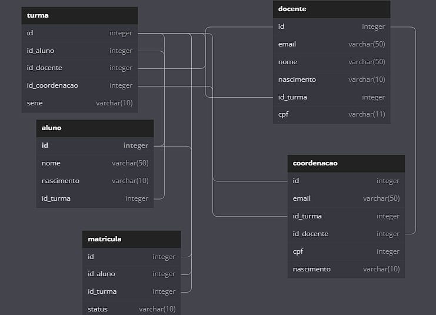

# Projeto Final do módulo 4 da Resilia

## API Escola
Nesse projeto fomos desafiados a desenvolver uma API que será o produto mínimo viável de um aplicativo, no nosso caso escolhemos o tema escola. 

## Tecnologias usadas
Para o desenvolvimento da API seguindo os padrões REST, utilizamos JavaScript com NodeJS e o framework Express, e como banco de dados relacional o SQLite, também fizemos
uso do padrão MVC e o padrão DAO durante o desenvolvimento do projeto

## Dependências necessárias para utilizar o projeto:
````js
  "dependencies": {
    "express": "^4.18.1",
    "sqlite": "^4.1.2",
    "sqlite3": "^5.0.11",
    "uuid": "^8.3.2"
  }
````
você também pode ver as dependências necessárias <a href = 'https://github.com/xand3/Projeto-Final-4-Resilia/blob/main/package.json'>aqui</a>
### Dependências usadas durante o desenvolvimento:
````js
"devDependencies": {
    "nodemon": "^2.0.19"
  }
````
Para instalar todas as dependências necessárias utilize o comando 
```
npm install express sqlite sqlite3 uuid
```
## Executando a API
para executar a API use o seguinte comando:
```
npm start
```

## Banco de dados
Para fazer a modelagem do banco de dados utilizamos o site <a href = 'https://dbdiagram.io/home'>DBDiagram</a> excelente plataforma para modelar um banco de forma rápida
abaixo segue o modelo que criamos:



Para o banco de dados de uma Escola criamos as entidades: Coordenacao, Docente, Turma, Matricula e Aluno.

## Rotas da API

### Docente
### Para incluir um docente o endereço é:
```
http://localhost:3000/docente
```
e no corpo da requisição POST é preciso passar um JSON com as seguintes informações:
````json
{
	"email": "example@email.com",
	"nome": "teste",
	"nascimento": "21/12/2002",
	"id_turma": "2",
	"cpf":  "123"
}
````
### Para buscar um docente especifico pelo seu id use:
```
http://localhost:3000/docente
```
passando no corpo da requisição o seguinte JSON
````json
{
	"id": 1
}
````
### Para buscar todos os docentes use:
```
http://localhost:3000/docentes
```
### Para atualizar o cadastro de um docente use:
```
http://localhost:3000/docente
```
passando no corpo da requisição um JSON que informa o id de qual docente vai ser editado
e as informações a serem editadas
````json
{
	"id": 1,
	"email": "novoemail.com",
	"nome": "alexandre",
	"nascimento": "21/12/2002",
	"id_turma": "2",
	"cpf":  "123"
}
````
### para excluir um docente use:
```
http://localhost:3000/docente
```
passando no corpo da requisição um JSON que informa o id do docente a ser excluido
````json
{
	"id": 1
}
````


